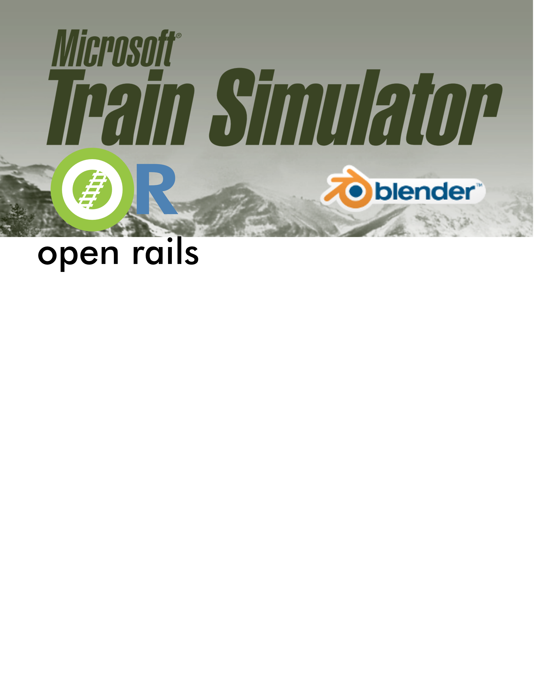

= Blender Exporter for MSTS and OPEN RAILS
:toc:
:toclevels: 5
:toc-title: Contents
:sectnums!:
:sectids!:
:chapter-label:
:doctype: book
:author: Wayne Campbell & Pete Willard
:email: petewillard@gmail.com
:homepage: http://www.railsimstuff.com
:revision: 5.2
:copyright: Copyright © 2020 - 2026
:title-page-background-image: 
:encoding: utf-8
:lang: EN
:experimental:
:icons: font
:pdf-page-size: [8.25in, 10.9in]
:gr: `
:mu: µ
:ohm: Ω
:dot: *
:union: ∩
:degree: °
:C: ©
:arrow: →
:shift:
:bar: |
:bleft: [
:bright: ]
:hash: #
:bslash: \
:BL: {
:BR: }
:sourcedir: code
:source-highlighter: rouge
:revnumber: .5
:revdate: 2026-09-18
:OR: Open Rails
:ORTS: Open Rails Train Simulator
:MSTS: Microsoft Train Simulator
:version: Blender 5.2 LTS +
:BV: 5.2
:AO: Ambient Occlusion

<<<
:numbered!:
[colophon]

Microsoft Train Simulator and  Open Rails exporter add-on for Blender

{revdate} {revision}{revnumber} {author}

COPYRIGHT
(c) 2019 - 2026 by Wayne Campbell and Pete Willard, distributed under the terms of the GNU GPL V3

This program is free software: you can redistribute it and/or modify it under the terms of the GNU General Public
License, Version 3, as published by the Free Software Foundation here.
This program is distributed in the hope that it will be useful, but WITHOUT ANY WARRANTY; without even the
implied warranty of MERCHANTABILITY or FITNESS FOR A PARTICULAR PURPOSE. See the GNU General
Public License, included in the distribution package, for more details.

You are welcome to repost this package, with local language translations if needed, on your local community web
site. Keep the package together with this document containing the copyright notice. Drop me an email so I can tell
others where its available.

== Microsoft Train Simulator/Open Rails exporter add-on for Blender

Blender 3.8+ Exporter for MSTS/OR, verified with Blender 5.2 LTS

* Version 5.2.5
* This is a script addon for the Blender 3D program. Use it to create .S shape files for Microsoft Train Simulator or Open Rails.
* This version of the EXPORTER is for Blender 3.8 and newer. It has been updated for current Blender 5.x releases while retaining compatibility with older supported Blender versions where possible. Use V3.5 of the exporter for Blender versions before 2.8.

=== REVISION HISTORY

    2026-09-18      Released V5.2.5 - pkw - Added OpenRails/MSTS export info sidecar reports
    2026-09-10      Released V5.2.4 - pkw - Copy source texture file when no matching ACE/DDS texture exists
    2026-09-10      Released V5.2.3 - pkw - Added optional copy of referenced ACE/DDS textures beside exported S files
    2026-09-10      Released V5.2.2 - pkw - Added SNAP object-name keyword to retain export hierarchy without using animation keywords
    2026-08-02      Released V5.2.1 - pkw - Blender 5.2 Action slot/f-curve compatibility and export cancel callback fix
    2026-07-15      Released V5.2.0 - pkw - Blender 5.2 LTS compatibility verification
    2026-06-21      Released V5.1.1 - pkw - Added more known animation part names
    2026-06-19      Released V5.1.0 - pkw - Blender 5.x compatibility update and animation handling tweaks
    2026-05-26      Released V5.0.0 - pkw - Blender 5.x shader node compatibility update
    2025-11-06      Released V4.8.1 - pkw - Repackaged for easier installation in Blender
    2025-10-08      Released V4.8  - pkw - Fix for Blender 4.5 Update for changes related to shader sockets
    2025-01-19      Released V4.7  - pkw - Fix for the deprecated specular which is now IOR (Index of Refraction) in 4.x
                    Note: It was causing the "recreateShaderNodes function to fail and cause the material nodes to all become disconnected.
    2024-12-12      Released V4.6  - pkw - Fix for the deprecated to.mesh in 4.x
    2024-04-03      Released V4.5  - pkw - Handling issues created by Blender 4.1 deprecating smoothing related APIs.
    2023-07-13      Released V4.4  - pkw
                    Added support for exporting texture references as DDS files instead of just ACE files using a checkbox.
                    Like the ACE file export, it changes *ALL* texture references to DDS when checked.
    2019-07-23      Released V4.3
                    Improved instructions around linking a part to multiple LOD collections
                    Fixed program error - no material slots, or empty material slot
    2019-07-21      Released V4.2 for testing
                    Added HierarchyOptimization
                    Added FastExport - improves speed 25 x
                    Restructured AddMesh, AddTriangle with MSTSMaterialsDetail structure to improve performance
                    Indexed vertices for faster export ( eg speedup by 3 times )
    2019-07-18      Released V4.1 to beta testers
                    Modified install package to work with 'Install from file..'
                    Fixed ShapeViewer crashes on animations(0)
    2019-07-17      Released V4.0 to beta testers
                    Updated for Blender 2.8
    2017-09-12      Released as V 3.5
                    added SubObjID to SubObjectHeader per report from 'Spike'
                    added support for Auto Smoothing per http://www.elvastower.com/forums/index.php?/topic/30491-blender-auto-smooth-and-msts-export/
    2016-01-11      Released as V 3.4
                    strip periods (.) from object names
                    fixes to LOD inheritance
                    remember RetainNames setting
                    file export dialog, default to .s extension
    2016-01-10      Testing as V 3.3
                    Added RetainNames option
                    Fixed bounding sphere bug
                    Trimmed most numbers to 6 decimal places to reduce output file size
    2016-01-10      Testing as V 3.2
                    Documented hidden option to use Railworks style LOD naming
                    Documented setting MAX values in Custom Properties
                    Fixed AttributeError: 'NoneType' object has no attribute 'game_settings'
    2016-01-09      Testing as V 3.1
                    Added MipMapLODBias setting
                    Fixed bug, untextured faces - AttributeError: 'NoneType' object has no attribute 'name'
                    Implemented MSTS sub_object flags for sorting alpha blended faces ( not needed for OR )
                    Implement MSTS sub_object flags for specularity ( not needed for OR )
                    Added Alpha Sorted Transparency option to MSTS Material
                    Improved descriptions and naming of MSTS Material settings
                    Fixed MSTS Lighting value not being saved
                    Sped up iVertexAdd, iNormalAdd, etc,  with spatial tree indexing, etc
    2016-01-08      Testing as V 3.0
                    Fix for WHEELS13, WHEELS23
                    Changed use_shadeless, from selecting Cruciform, now done with MSTS Lighting
                    Added MSTS Material panel for lighting options, etc
                    Added support for Railworks style LOD naming
    2015-11-11      Released as V 2
                    Changed prim_state labels to be compatible with Polymaster
    2013-11-01      Initial Release as V 2.6.3

=== Conventions Used

NOTE: Regular Note.

WARNING: Pay attention to these.

IMPORTANT: You should know this.

CAUTION: With care, you can succeed.

TIP: Optional, but good to know.

`Highlighting`

*BOLD*

_Italic_

----
Source code
----

kbd:[LMB]:: Left Mouse Button
kbd:[MMB]:: Middle Mouse Button
kbd:[RMB]:: Right Mouse Button
_N-Panel_:: Number Panel, kbd:[N] Hotkey in Main 3D Window
btn:[ENTER]:: Sometimes you will see KEYBOARD entry look like this

Referenced footnotes appear at the *end* of Chapters

Web Links should be active and will open in your web browser if your PDF reader supports it.

:numbered!:

:sectids!:
:numbered!:
include::guide.adoc[]
